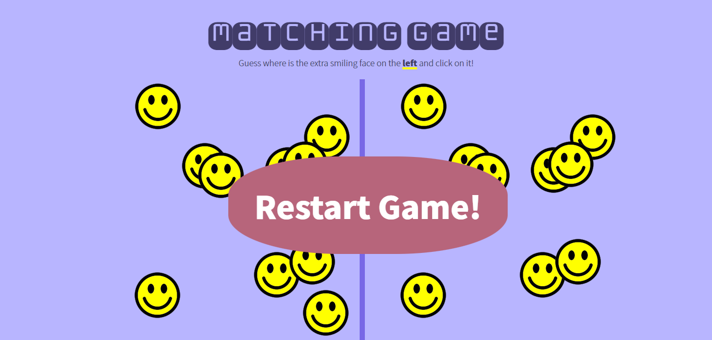

# Matching game
This matching game was created as one of the challenges in Nucamp Coding Bootcamp. It was a great way to learn about JavaScript, DOM manipulation and on top of that, it was a great way to give freedom to my creativity, mixing the right colors, fonts, giving the game a nice UI, while maintaining its functionality. This is a fun, challenging game to try.

## Instructions:
First, pick a level (easy, medium or difficult). Next, just give it a try and guess where is the extra smiling face on the left and click on it. Finally, repeat as many times as you can; the game will get more difficult each time you correctly select the extra face!

## Screenshots:

## Technologies:

## Features:
It has added level of difficulty, feature provided by JavaScript and the ability to duplicate images through DOM manipulation.

## Want to see it live? Visit the [Matching game](https://ibadra.github.io/matching.github.io/) page! 🙂

